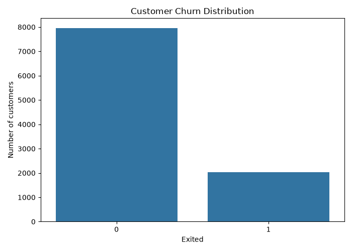

# Bank Customer Churn Prediction

A machine learning project that predicts whether a bank customer
is likely to leave based on demographic, financial and account
activity information.

## Overview

Customer churn is an important problem for banks because retaining
existing customers can be more cost-effective than acquiring new ones.

This project compares Logistic Regression and Random Forest
classifiers for predicting customer churn.

## Dataset

The dataset contains information about 10,000 bank customers,
including:

- Credit score
- Geography
- Gender
- Age
- Account balance
- Number of products
- Credit card ownership
- Account activity

The target variable is `Exited`, indicating whether the customer
left the bank.

## Technologies

- Python
- Pandas
- NumPy
- Scikit-learn
- Matplotlib
- Seaborn

## Project Structure

customer-churn-prediction/
│
├── data/
├── results/
├── src/
├── README.md
├── requirements.txt
└── .gitignore

## Methodology

1. Load and inspect the dataset
2. Perform exploratory data analysis
3. Encode categorical variables
4. Split data into training and testing sets
5. Scale numerical features
6. Train Logistic Regression
7. Train Random Forest
8. Evaluate both models
9. Analyse feature importance

## Results

The dataset is imbalanced, with substantially more customers remaining than churning so model performance is evaluated with precision, recall, F1 score and ROC-AUC on top of accuracy.

| Model | Accuracy | Precision | Recall | F1 | ROC-AUC |
|-------|----------|-----------|--------|----|---------|
| Logistic Regression | XX | XX | XX | XX | XX |
| Random Forest | XX | XX | XX | XX | XX |

## Visualisations

### Churn Distribution



### Confusion Matrix


### Feature Importance


## Key Findings

- ...
- ...
- ...

## How to Run

Clone the repository and install the dependencies:

```bash
pip install -r requirements.txt